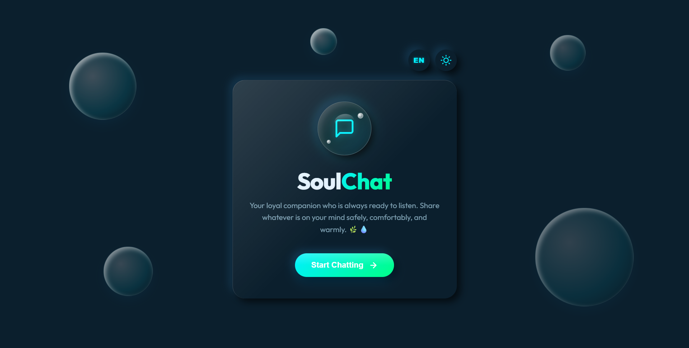
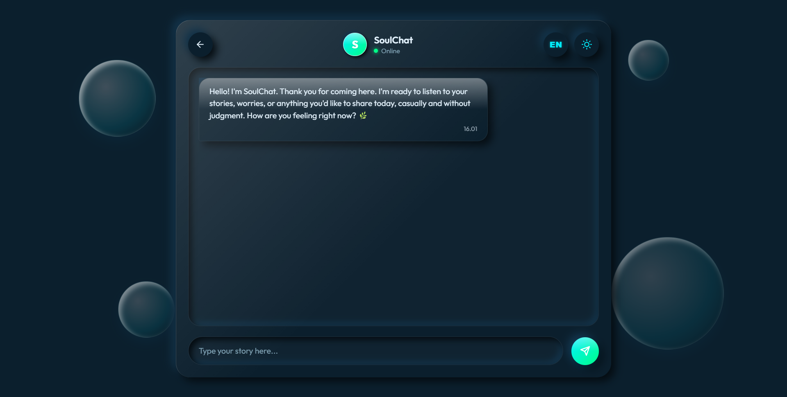

# 🫧 SoulChat - Empathetic Companion Chatbot

> A warm, non-judgmental virtual companion chatbot with a refreshing Frutiger Aero × Neumorphism UI design.





## 📋 Overview

**SoulChat** adalah aplikasi chatbot yang dirancang untuk menjadi pendengar yang empati dan mendukung. Dengan antarmuka yang hangat dan menenangkan, SoulChat memungkinkan pengguna untuk berbagi pikiran, perasaan, kekhawatiran, dan kegembiraan mereka dalam bahasa pilihan mereka.

Didukung oleh **Google Gemini API**, SoulChat memahami konteks percakapan dan memberikan respons yang penuh empati, non-judgmental, dan mendukung.

## 🎓 Workshop Hacktiv8 - Maju Bareng AI

Proyek ini adalah salah satu tugas dari workshop **"Maju Bareng AI"** yang diselenggarakan oleh **Hacktiv8**. Workshop ini dirancang untuk mengajarkan developer bagaimana mengintegrasikan teknologi AI dalam aplikasi modern, khususnya menggunakan Google Gemini API untuk membuat chatbot yang empati dan user-friendly.

## ✨ Features

- 🌍 **Bilingual Support**: Dukungan otomatis untuk bahasa Indonesia dan English (dengan kemampuan adaptasi untuk bahasa lainnya)
- 🎨 **Frutiger Aero × Neumorphism Design**: UI yang modern, fresh, dan menenangkan dengan visual elements yang inspiring
- 💬 **Empathetic Responses**: AI companion yang memahami emosi dan memberikan respons yang penuh perhatian
- 🌊 **Dynamic Theme**: Light dan Dark mode untuk pengalaman visual yang optimal
- 📱 **Responsive Design**: Bekerja sempurna di desktop, tablet, dan mobile
- 🔒 **Privacy-Focused**: Percakapan Anda adalah prioritas
- ⚡ **Fast & Reliable**: Dioptimalkan untuk kecepatan dengan deployment di Vercel

## 🛠️ Tech Stack

### Frontend
- **HTML5** - Semantic markup
- **CSS3** - Modern styling dengan Neumorphism design
- **Vanilla JavaScript** - Interactive UI logic

### Backend
- **Node.js** - JavaScript runtime
- **Express.js** - Web framework
- **Google Gemini API** - AI engine untuk generating empathetic responses

### Deployment
- **Vercel** - Serverless deployment platform

## 🚀 Quick Start

### Prerequisites
- Node.js 16.x atau lebih tinggi
- npm atau yarn package manager
- Google Gemini API Key (dapatkan di [Google AI Studio](https://aistudio.google.com/app/apikey))

### Installation

1. **Clone repository**
```bash
git clone <repository-url>
cd soulChat
```

2. **Install dependencies**
```bash
npm install
```

3. **Setup environment variables**
Buat file `.env` berdasarkan `.env.example`:
```bash
cp .env.example .env
```

Edit `.env` dan tambahkan API key Anda:
```
GEMINI_API_KEY=your_google_gemini_api_key_here
PORT=3000
```

4. **Run aplikasi secara lokal**
```bash
# Development dengan Vercel CLI
npm run dev

# Atau gunakan Node.js langsung
npm start
```

Aplikasi akan berjalan di `http://localhost:3000`

## 📖 Usage

1. **Buka aplikasi** di browser Anda
2. **Pilih bahasa** (Indonesian/English) dari tombol di layar
3. **Mulai berbincang** dengan SoulChat
4. **Share your feelings** - Bagikan apapun yang ingin Anda bicarakan
5. **Dapatkan dukungan empati** dari companion virtual Anda

### Mode Gelap/Terang
Klik tombol tema di pojok kanan atas untuk beralih antara light dan dark mode.

## 🏗️ Project Structure

```
soulChat/
├── api/
│   └── chat.js              # Backend API endpoint
├── public/
│   ├── index.html           # Main HTML template
│   ├── app.js               # Frontend JavaScript logic
│   └── style.css            # Styling (Neumorphism + Frutiger Aero)
├── .env.example             # Environment variables template
├── .gitignore               # Git ignore rules
├── package.json             # Project dependencies
├── vercel.json              # Vercel deployment config
└── README.md                # This file
```

## 🔧 API Endpoints

### POST `/api/chat`
Mengirim pesan ke chatbot dan menerima respons empati.

**Request Body:**
```json
{
  "message": "Aku merasa sedih hari ini",
  "history": [
    { "role": "user", "content": "Halo, apa kabar?" },
    { "role": "assistant", "content": "Halo sahabat! Aku baik-baik saja..." }
  ]
}
```

**Response:**
```json
{
  "reply": "Aku mengerti, itu pasti terasa berat... Aku di sini untuk mendengarkan 🫶",
  "history": [...]
}
```

## 🌐 Environment Variables

| Variable | Description | Required |
|----------|-------------|----------|
| `GEMINI_API_KEY` | Google Gemini API Key | Yes |
| `PORT` | Server port (default: 3000) | No |

## 🚀 Deployment

### Deploy ke Vercel (Recommended)

1. **Push ke GitHub**
```bash
git add .
git commit -m "Initial commit"
git push origin main
```

2. **Connect dengan Vercel**
- Kunjungi [Vercel Dashboard](https://vercel.com/dashboard)
- Klik "New Project" dan pilih repository Anda
- Vercel akan otomatis mendeteksi konfigurasi

3. **Setup Environment Variables**
- Di Vercel dashboard, pergi ke "Settings" → "Environment Variables"
- Tambahkan `GEMINI_API_KEY` dengan value API key Anda
- Redeploy

4. **Live! 🎉**
Aplikasi Anda sekarang live di `https://your-project.vercel.app`

## 🤝 Contributing

Kontribusi adalah welcome! Berikut caranya:

1. Fork repository
2. Buat feature branch (`git checkout -b feature/AmazingFeature`)
3. Commit changes (`git commit -m 'Add some AmazingFeature'`)
4. Push ke branch (`git push origin feature/AmazingFeature`)
5. Buat Pull Request

## 📝 License

Proyek ini dilisensikan di bawah MIT License - lihat file [LICENSE](LICENSE) untuk detail.

## 💡 Design Philosophy

**SoulChat** menggabungkan estetika **Frutiger Aero** (playful, colorful, optimistic) dengan prinsip **Neumorphism** (minimalis, soft, depth). Kombinasi ini menciptakan interface yang:
- ✨ Menarik secara visual namun tidak overwhelming
- 🌊 Tenang dan mendukung untuk percakapan sensitif
- 💙 Membuat pengguna merasa didengar dan dihargai

## 🎯 Future Enhancements

- [ ] Conversation history storage dengan database
- [ ] User authentication & personalized profiles
- [ ] Mood tracking & analytics
- [ ] Multi-language support expansion
- [ ] Voice input/output capability
- [ ] Offline mode support
- [ ] Mobile app (React Native)

## 📞 Support

Jika ada pertanyaan atau issues, silakan buat issue di repository atau hubungi tim development.

---

**Made with 💙 and empathy for the community.**
